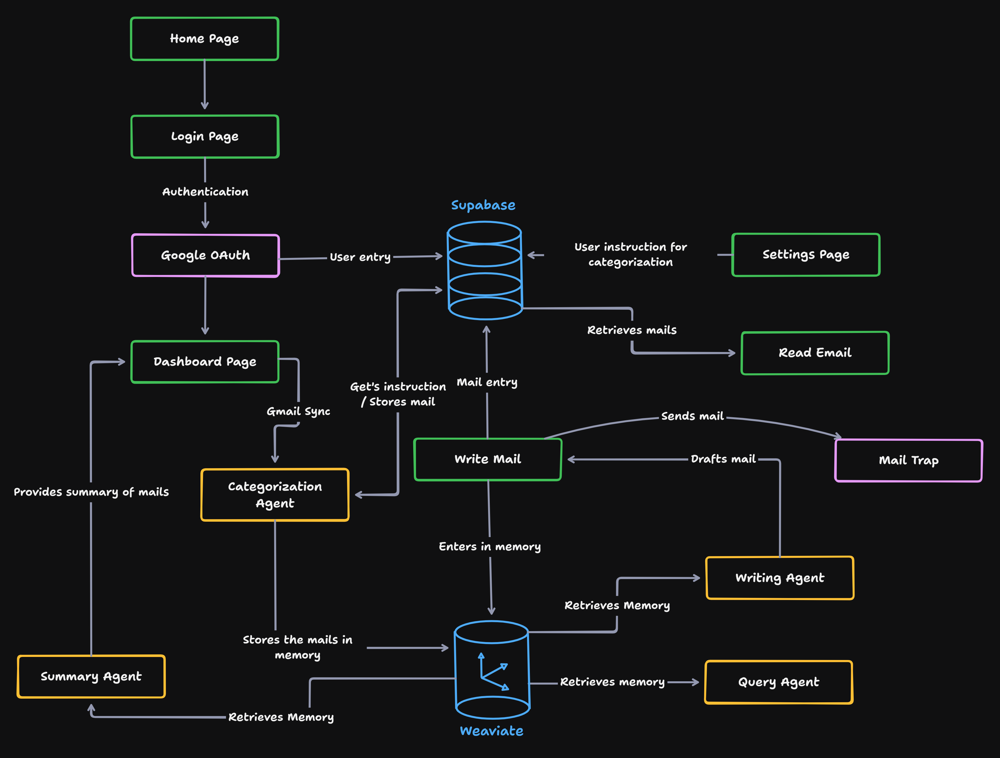

# Chill Work Email Agent
## Overview
Chill Work Email Agent is an email assistant designed to reduce email overload by prioritizing, organizing, and automating email interactions. Acting as a seamless intermediary between users and their email clients (e.g., Gmail, Outlook). It prioritizes critical emails, generates contextually relevant responses, and stores email content and attachments in a Graphlit for smarter, faster drafting, delivering an intuitive email management experience.
## Working of the app

## Demo of the app
https://github.com/user-attachments/assets/dff7be14-bc95-4dda-9378-a0a5874befdd
## Tech Stack
1. **Agno** - AI Agent
2. **Google OAuth** - Authentication 
3. **Google API** - Google Gmail API
4. **Weaviate** - Vector Database
5. **FastAPI** - Web Framework
6. **Uvicorn** - ASGI Server
7. **Next JS** - Front web application
8. **Supabase** - Postgres Database
9. **Groq** - Inference of LLM
10. **MailTrap** - To send mails
## Setup Instruction
### Front End
Enter the following command line to install all the dependencies :
```bash
npm install
```
Create `.env.local` file to add the backend router endpoint URL :
```.env.local
NEXT_PUBLIC_API_BASE_URL=http://localhost:8000
```
To run the app, run this command
```bash
npm run dev
```
### Backend
This FastAPI app is maintained by `uv` package manager. Enter this single command to install all the packages.
```bash
uv sync
```
To activate the virtual environment
```bash
source /path/to/your/venv/bin/activate
```
In powershell
```shell
.venv/Scripts/activate.ps1
```
> Ensure to follow the `docs/` to setup the Tech Stack for the app before running the `main` script.
To run the backend ASGI server
```bash
uvicorn main:app --reload --port 8000
```
