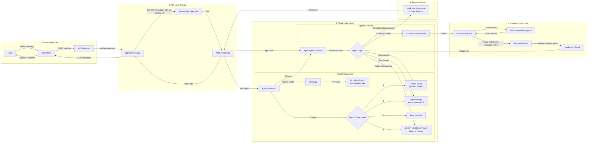
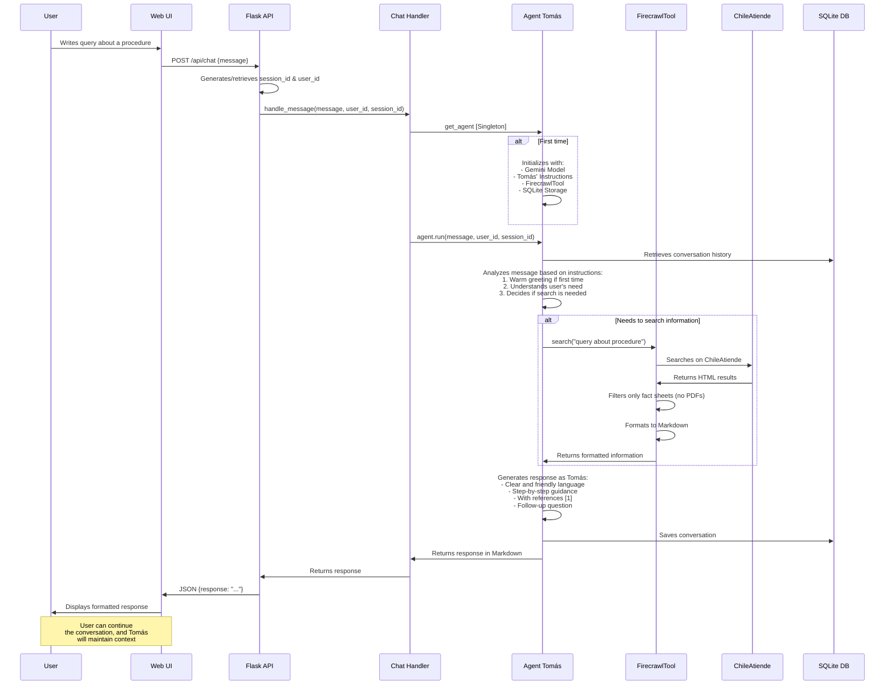

# ChileAtiende AI Assistant

## Overview and Business Objective

This project is an artificial intelligence assistant that ingests, indexes, and reasons about all public information on the *chileatiende.gob.cl* website. Its main goal is to provide clear and concise answers to citizens' questions about government services, saving them valuable time, with a special focus on assisting older adults.

The project aims to demonstrate a pipeline where a single AI agent crawls, structures, and continuously refreshes ChileAtiende content, providing reliable, citation-backed answers in natural language.

## Video Demo

LINK: <https://youtu.be/xKKGC60bA4g?si=DN_hUMciPLxKHAjz>

## Project Team

This project was developed by:

*   **Team Lead**: `@estebanrucan` (Data Scientist Engineer)
*   **Team Member**: `@Constanza-Riquelme` (Data Analyst)

*We've built machine-learning solutions for consumer-goods data. Esteban designs end-to-end ML pipelines in telco environments; Constanza analyzes and models high-volume FMCG datasets to inform business decisions.*

## Features

*   **Intelligent Conversational Assistant**: Interacts with users in natural language to resolve queries about ChileAtiende procedures and services.
*   **Firecrawl Integration**: Uses Firecrawl to perform real-time searches on the ChileAtiende site and extract relevant information.
*   **Language Model Processing (LLM)**: Employs Google's Gemini to understand queries and generate coherent, user-friendly responses.
*   **Session-Based Memory**: The agent remembers the conversation context during the user's current session for a smoother and more personalized interaction.
*   **Elderly-Friendly Interface**: Clean frontend design with good readability and easy navigation.
*   **Flask Backend**: Modular and robust structure using Flask and Blueprints.

## Project Structure

The project follows a modular structure to facilitate maintenance and scalability:

```
/chileatiende_assistant
├── app/                    # Main Flask application module
│   ├── __init__.py         # Flask application factory, registers Blueprints
│   ├── main/               # Blueprint for UI routes (serves index.html)
│   │   ├── __init__.py
│   │   └── routes.py
│   ├── api/                # Blueprint for the chat API (/api/chat)
│   │   ├── __init__.py
│   │   └── routes.py
│   ├── agent_core/         # Core logic for the Agno agent
│   │   ├── __init__.py
│   │   ├── agent_config.py # Agent tool and instruction configuration
│   │   ├── agent_setup.py  # Agent, Models, Storage initialization
│   │   └── chat_handler.py # Logic for handling messages with the agent
│   ├── static/             # Static files (CSS, JS)
│   │   ├── css/style.css
│   │   └── js/app.js
│   └── templates/          # HTML templates (index.html)
├── data/                   # Directory for databases (e.g., agent_sessions.db)
├── config.py               # Flask application configurations (keys, debug)
├── run.py                  # Script to run the application (primarily used inside Docker)
├── .env                    # File for environment variables (API Keys) - YOU MUST CREATE THIS
├── .env.example            # Example environment variables 
├── requirements.txt        # Project dependencies (used by Docker)
├── Dockerfile              # Defines the Docker image for the application
├── .dockerignore           # Specifies files to ignore by Docker
├── docker-compose.yml      # Defines services, networks, and volumes for Docker
├── tests/                  # Directory for tests
│   ├── __init__.py
│   ├── conftest.py         # Common test configurations (fixtures)
│   ├── test_agent_core.py  # Tests for the agent core
│   ├── test_api.py         # Tests for API routes
│   └── test_app.py         # General application tests
└── README.md               # This file
```

## Prerequisites

*   Docker Desktop (or Docker Engine + Docker Compose) installed and running.
*   A modern web browser.
*   Git (for cloning the repository).

## Environment Setup

1.  **Clone the Repository**:
    ```bash
    git clone <repository_url>
    cd chileatiende_assistant 
    ```
    (Replace `<repository_url>` with the actual URL of your Git repository)

2.  **Configure Environment Variables**:
    In the project root, you will find a file named `.env.example`.
    Make a copy of this file and name it `.env`:

    *   On Windows (Command Prompt or PowerShell):
        ```bash
        copy .env.example .env
        ```
    *   On macOS/Linux (Terminal):
        ```bash
        cp .env.example .env
        ```
    
    Now, open the `.env` file and fill in your actual API keys and any other necessary configurations:

    ```env
    FIRECRAWL_API_KEY="your_firecrawl_api_key_here"
    GOOGLE_API_KEY="your_google_gemini_api_key_here"
    SECRET_KEY="change_this_to_a_very_long_and_secure_secret_string"
    FLASK_DEBUG=True # Set to False for production-like behavior within Docker
    ```
    Replace the placeholder values with your actual credentials and desired settings. The `.env` file is crucial for the application to run correctly inside Docker and is included in `.dockerignore`, so it won't be committed to version control.

## Running the Application (with Docker)

With Docker and Docker Compose installed, and your `.env` file configured:

1.  **Build and Run the Application and Tests**:
    Open your terminal in the project root directory (`chileatiende_assistant`) and run:
    ```bash
    docker-compose up --build
    ```
    This command will now orchestrate the services as follows:
    *   First, it builds the Docker image for the application (if it's the first time or if `Dockerfile` or related files changed).
    *   Then, it starts the `tests` service. This service runs all project tests (e.g., `pytest --cov=app`).
    *   **If any tests in the `tests` service fail, the `docker-compose up` process will stop, and the `app` service will not start.**
    *   If all tests in the `tests` service pass, it will complete successfully.
    *   Only then will the `app` service start. The `app` service itself (using `run.py`) will *also* execute the tests again as an internal check before launching the Flask application server.

2.  **Access the Application**:
    If all tests pass and the `app` service starts, the Flask application will be available at `http://127.0.0.1:5000/` or `http://localhost:5000/`.
    Open this URL in your web browser to interact with the assistant.

3.  **Stopping the Application**:
    To stop the application, press `Ctrl+C` in the terminal where `docker-compose up` is running. To remove the containers, you can run `docker-compose down`.

## Testing (with Docker)

The project is configured to run tests in two main ways with Docker:

1.  **Automatically during Application Startup**:
    As described in the "Running the Application" section, when you run `docker-compose up`, the `tests` service runs first. If these tests fail, the application service (`app`) will not start. If they pass, the `app` service will then also run the tests internally via `run.py` before starting the Flask server.

2.  **Independently via a Dedicated Test Command**:
    If you want to run tests without starting the full application, or to see test output more directly:
    *   Ensure your `.env` file is configured, as tests might require API keys or other environment variables.
    *   Open your terminal in the project root and execute:
        ```bash
        docker-compose run --rm tests
        ```
    This command specifically runs the `tests` service defined in `docker-compose.yml`, which executes `pytest --cov=app`. The `--rm` flag ensures the container is removed after tests complete. You will see the test results and coverage report in your terminal.

To generate and view an HTML coverage report:

1.  First, ensure the `htmlcov` directory can be written to by the Docker container or adjust volume mounts if needed. For simplicity, you can run tests, then copy the `htmlcov` directory out if it's generated inside the container, or modify the test command to output it to a mounted volume.
    A simpler approach for HTML reports with Docker might involve running pytest outside Docker if you have a local Python environment set up, or by entering the running `app` container:
    ```bash
    # If app is running via docker-compose up -d
    docker-compose exec app pytest --cov=app --cov-report=html
    # Then, the htmlcov directory will be inside the container's /usr/src/app.
    # You might need to copy it out: docker cp <container_id>:/usr/src/app/htmlcov ./htmlcov
    ```
    Alternatively, for CI/CD, the terminal output of `pytest --cov=app` is often sufficient.

## Technologies Used

*   **Python**: Main programming language.
*   **Flask**: Web microframework for the backend.
*   **Agno**: Framework for creating AI agents.
*   **Firecrawl SDK**: For interacting with the Firecrawl service and performing web searches.
*   **Google Gemini**: Large language model for natural language processing.
*   **HTML, CSS, JavaScript**: For the chat user interface.
*   **SQLite**: For agent session storage.
*   **python-dotenv**: For managing environment variables.
*   **Docker & Docker Compose**: For containerization and simplified deployment/development.

## Agent Architecture and Flow

This section outlines the architecture of the ChileAtiende AI Assistant and the typical flow of user interaction.

### Overall Architecture

The following diagram illustrates the main components of the application and how they are layered:



### Interaction Flow (Agent Tomás)

This sequence diagram shows the typical interaction flow when a user asks a question:



## Potential Future Improvements

*   Add more tools to the agent (e.g., querying other databases).
*   Implement an admin panel for monitoring interactions.
*   Develop more comprehensive unit and integration tests. 

## Testing

This project uses `pytest` for running tests and `coverage.py` (via `pytest-cov`) for measuring test coverage.

### Prerequisites for Testing

Ensure you have installed the development dependencies:

```bash
pip install -r requirements.txt 
# (pytest, pytest-cov, and coverage are included in requirements.txt)
```

### Running Tests

To run all tests and see a quick summary of coverage in the terminal:

```bash
pytest --cov=app
```

To generate a detailed HTML coverage report (after running the command above or just `pytest --cov=app`):

1.  Run pytest with HTML report generation:
    ```bash
    pytest --cov=app --cov-report=html
    ```
2.  Open the generated report in your browser:
    ```
    htmlcov/index.html
    ```

This report will show line-by-line coverage for each file in the `app` module.

The goal is to maintain 100% test coverage. 
