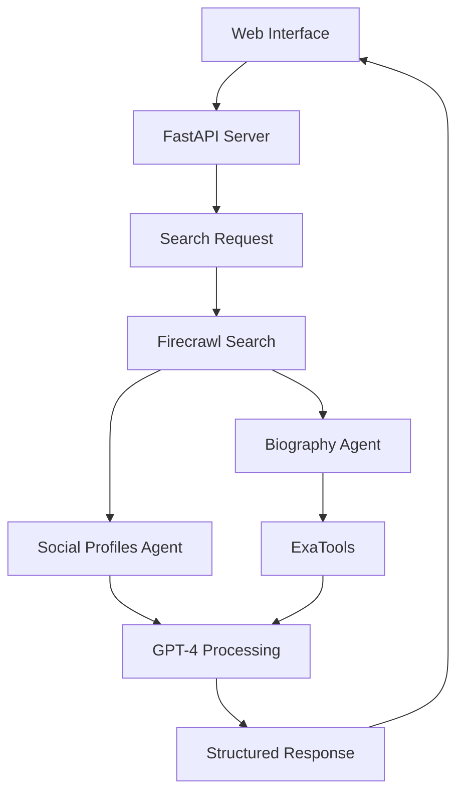

# Deep User Researcher

## Overview of the Idea

A powerful AI agent that performs deep research on users across various platforms and sources. The agent uses a combination of [Firecrawl](https://firecrawl.dev) and [Exa](https://exa.ai) for web searches and GPT-4o via [Agno](https://agno.com) for intelligent data extraction and analysis, making it easy to gather comprehensive user information from multiple sources.

## Project Goal

To create an intelligent system that can automatically gather, analyze, and present comprehensive user information from various online sources, saving time and providing structured insights for user research.

## Use Cases

- **Background Verification**: Quick and comprehensive verification of professional credentials, employment history, and educational background.
- **Social Media Intelligence**: Analysis of social media presence, content patterns, and online reputation across platforms.
- **Sales Intelligence**: Lead qualification and enrichment through professional background analysis and role verification.
- **Recruitment & HR**: Streamlined candidate verification and assessment of professional background and online presence.
- **Business Development**: Research and analysis of potential partners, industry experts, and market opportunities.

## How It Works

- **User Flow**:

  1. User accesses the web interface
  2. Enters the target user's full name and handle
  3. System performs automated search and analysis
  4. Results are presented in a structured format

- **Core Functionality**:

  - Web-based interface for easy user research
  - Intelligent social media profile detection and analysis
  - Automated biography generation
  - User information extraction including:
    - Citizenship
    - Birth year
    - Current location
    - Profile picture URL
  - Structured data output in JSON format
  - Text-based search and analysis
  - Profile picture URL extraction
  - Web interface for interaction

## Tools Used

- FastAPI for the web server
- Agno for AI agent orchestration
- Firecrawl for web searches
- OpenAI GPT-4 for intelligent data processing
- Pydantic for data validation
- Jinja2 for templating
- Exa for crawling more information about the user from different websites

## UI Approach

The project features a clean, modern web interface built with FastAPI and Jinja2 templates. Users can easily input search parameters and view results in a well-organized format. The interface is designed to be intuitive and user-friendly, requiring minimal technical knowledge to operate.

## Visuals

## Team Information

- **Team Lead**: [Harsh Agrawal](https://github.com/itsharshag)
- **Team Members**: [Harsh Agrawal](https://github.com/itsharshag)
- **Background/Experience**: Experienced in AI and Web Development

## Prize Category (leave blank, to be assigned by judges)

- [ ] Best use of Agno
- [ ] Best use of Firecrawl
- [ ] Best use of Mem0
- [ ] Best use of Graphlit
- [ ] Best use of Browser Use
- [ ] Best use of Potpie
- [ ] Best Overall Project

## Demo Video Link

[To be added after completion]

## Additional Notes

The project demonstrates the power of combining multiple AI tools and services to create a comprehensive user research solution. It showcases how Agno and Firecrawl can be effectively integrated to create a powerful, automated research tool that saves time and provides valuable insights.
